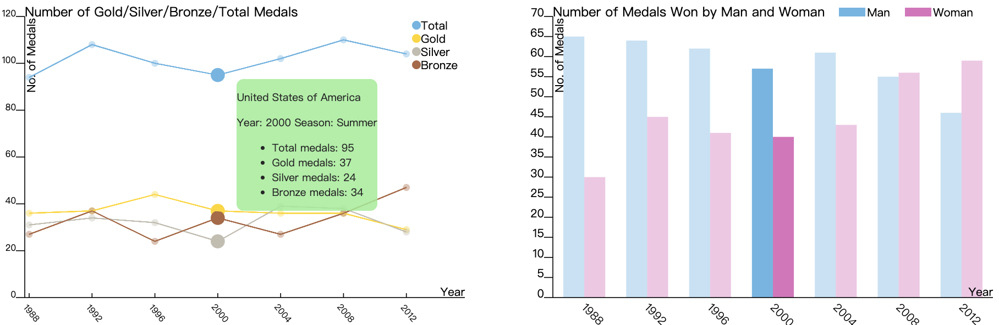
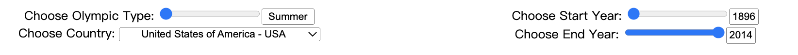

## Visualization of Olympic Performances

## Contributors
Anran Wang aw3919@nyu.edu
Calvin Shi cs6308@nyu.edu
Haoxuan Sun hs4379@nyu.edu

## Instructions
This project is developed for the course Information Visualization in Spring 2022. To run the webpage, you need to download the source code and webpack server. Then use `npx install` and `npm webpack server` to run it.

# Proposal

## Overview
The Olympics have long been known as the symbol of competitive athletic spirit, while they have also witnessed historical events and changes. In the first Olympic female athletes were not even allowed to compete, but now more and more female athletes are competing for themselves, for their nation and for their people. From WWII to the modern day COVID pandemic, people continue to show their resilience and perseverance with participation in the Olympics. How did my nation perform in the Olympics? That might be a question that comes naturally when you’re watching them. For our project, we intend to propose a visualization system that helps the general audience to find out how each nation performs in the Olympics on a time scale.

## Description of Dataset and Processing
We found and will visualize a dataset named [Olympic Sports and Medals, 1896-2014](https://www.kaggle.com/datasets/the-guardian/olympic-games), which contains about 37,000 records of every Olympic athlete that has won a medal from the first Olympics Athens 1896 to the XXII Olympic Winter Games Sochi 2014. Each record consists of 9 attributes that describe the information of an awarded athlete: game year, host city, athlete name, athlete country code, athlete gender, sport, discipline, event and the type of medal awarded.
The data was provided by the IOC Research and Reference Service and published by the Guardian's Datablog, so it is highly reliable. Although a few records are missing information, we have filled them using data from the International Olympic Committee’s website. In order to improve user experience in the visualization, we aggregate statistics from the original dataset and export a much smaller dataset in size, which enables better processing/loading speed and thus better user experience.
Not all attributes provided by the original dataset will be used in this project. Only a few of them are aggregated into a processed dataset and will be visualized:

- Olympic Game Year
- Summer/Winter Olympic Game
- Number of total/gold/silver/bronze medal a country won in an Olympic game
- Number of medal a country won by male/female in an Olympic game

## Usage Scenarios & Tasks
After watching the 2020 Tokyo Olympics, Lily is so intrigued that she would like to know more about how each nation is performing in the Olympics. She wants to know how many medals her nation has won in previous games and its historic changes. She also wants to see how female athletes are doing in the games. So she logs on to the visualization system, and sees a geographical map of the world. Each country is colored with a different gradient by the number of medals they historically won. She gets the sense that her nation ranks pretty high for the numbers and immediately hovers over it. The following line and bar chart change accordingly. The line chart shows the number of gold, silver, and bronze medals achieved by her nation from 1896 to 2014. The bar chart shows the number of athletes participating in the olympics. She notices that more and more athletes are competing in the games, and it’s becoming more gender balanced. Besides the chart, there’s a drop-down list for her to select a specific country. She selects the country her friend comes from, and all  three charts change to the data about that country. She is now able to compare between different countries and she sees that the gender distribution of the athletes is pretty skewed. These all help her to see how each nation is performing in the Olympic games throughout time and to compare them.

## Description of Visualization & Sketch
Three views will be presented in this project: geo-map, line chart, and bar chart respectively.

The first view (geo-map) visualizes a country’s performance in the Olympics determined by the total number of medals won and using color legend. When hovering over a country, a tooltip pops up showing the name of the country as well as how many medals the country won. 

The second view (line chart) visualizes the trend of total/gold/silver/bronze medals won by a country in a period of time. When hovering over a point, a tooltip shows up showing the country’s name as well as a detailed breakdown of how many medals the country won. 

The third view (grouped bar chart) visualizes the comparison of the number of medals a country won by female and male athlete in a period of time. When hovering over a grouped bar, a tooltip shows the country's name with how many medals females and males won respectively. 

There are 5 UI widgets designed for these views: one radio button for users to choose to display summer or winter Olympic data; one drop-down for users to select the country of interest; two  drop-downs for users to choose the start and end years of their time period. All three views are linked together. When users modify filters in UI widgets, all three views will be updated. The line chart and the grouped bar chart are linked bidirectionally. When hovering over a point or a grouped bar, the corresponding grouped bar and points will be highlighted immediately, and the geomap data updates as well.

The must-have features for this project is the interactions/links among the three views, without which the project would not be as interesting. The three views linked together give users multidimensional information about how a country performed in the past games. From horizontal comparison (number of medals a country won) to vertical comparison (number and type of medals a country won) to gender comparison (number of medals a country’s male and female athletes won), users are able to receive key information necessary to easily gauge how well a country has performed in the Olympics.

## Work Breakdown and Schedule

| Task  |Estimated Time |Target Date|Notes|
| ------------- | ------------- | ------------- | ------------- |
| Geo-map (static view) - Calvin|2 hrs|4/25/22|Draw projection of world borders using D3. Define colormap encoded by medal count.|
|Line Chart (static view) - Anran|2 hrs|4/27/22|Define axes and scales using medal data.Plot points for bronze, silver, gold, and total medal count.Draw respective lines.|
|Bar Chart (static view) - Haoxuan|2 hrs|4/29/22|Define axes and scales using medal data. Draw bars for male, female, and total medal count.|
|Geo-map (interactive view) - Calvin|2 hrs|5/1/22|Implement highlighting of regions on mouse event. Create tooltip displaying selected country’s performance.|
|Line Chart (interactive view) - Anran|2 hrs|5/3/22|Implement highlighting of points on mouse event. Create tooltip displaying year and medal count.|
|Bar Chart (interactive view) - Haoxuan|2 hrs|5/5/22|Implement highlighting of bars on mouse event. Create tooltip displaying year and medal count.|
|Linking the views - Calvin, Anran, Haoxuan|2 hrs|5/7/22|Add drop-down selectors for choosing time period, event, and country. Link drop-down selector to filter the data visualized in the views. Link geo-map mouse event to the country selection of the line chart and bar chart.|
|Optional features - Calvin, Anran, Haoxuan|Remaining time|5/9/22|TBD|

# Final Project Report

## Overview

The Olympics have long been known as the symbol of competitive athletic spirit, while they have also witnessed historical events and changes. In the first Olympic female athletes were not even allowed to compete, but now more and more female athletes are competing for themselves, for their nation and for their people. From WWII to the modern day COVID pandemic, people continue to show their resilience and perseverance with participation in the Olympics. When watching the 2020 Tokyo Olympics, you might be wondering, how has my nation performed in past Olympics? To address that question, we built a visualization system that helps audiences find out how each nation performed in the Olympics from 1896 to 2014. We use a geo-map to help the audience locate the country of their interest, a line chart to show the general trend of the medals won by a certain country, and a bar chart to visualize the distribution of medals won by male and female athletes. Here is a screenshot of our final product.

## Data
A table dataset called [Olympic Sports and Medals, 1896-2014](https://www.kaggle.com/datasets/the-guardian/olympic-games) is used in this project, which contains about 37,000 records of every Olympic athlete that has won a medal from the first Olympics in Athens 1896 to the XXII Olympics Winter Games in Sochi 2014. Each record consists of 10 attributes that describe the information of an awarded athlete. Detailed information of each attribute is listed in the table on the right.

The dataset was provided by the IOC Research and Reference Service and published by the Guardian's Datablog, so it is highly reliable. A few records with missing information have been filled through searching for data from the International Olympic Committee’s website.
In order to improve user experience in the visualization and to lower the server’s burden, we aggregated the statistics from the original dataset and exported a much smaller dataset in size, which only contains the attributes to be visualized. We paid close attention when processing the data of medals won by male and female athletes because of various gender mixed events. Detailed information of each attribute is listed below.

## Goals & Tasks

After watching the 2020 Tokyo Olympics, Lily is intrigued to know how many medals her nation has won in previous games and its historic changes. She also wants to see how female athletes are doing in the games. So she logs on to the visualization system, and sees a geo-map of the world. Each country is colored with a different gradient determined by the number of medals they historically won. She gets the sense that her nation ranks pretty high for the numbers and immediately clicks it. The following line and bar chart change accordingly. The line chart shows the number of gold, silver, and bronze medals achieved by her nation from 1896 to 2014. The bar chart shows the number of medals won by male and female athletes. She notices that female athletes are catching up with male athletes and have even won more medals than them in recent years. Above the charts, there’s a drop-down menu for her to select a specific country. She selects the country her friend comes from, the line chart and the bar chart change accordingly. She is now able to compare how each nation is performing in the Olympic games throughout time.

With regard to this specific usage scenario, our objective for the project was to first build a visual hierarchy that puts the selection of a specific country into the spotlight. The audience is then able to explore different aspects of a nation's performances in past summer or winter Olympics, while following the inner logic of our dataset. Secondly, since we intend to utilize different views for different types of data, the readability of our graphs and choice of marks and channels are of importance. We use the position channel and line mark so that the audience can directly perceive the changes in number. At the same time, we utilize the color channel (gold, silver, and bronze) to help the audience distinguish between different lines representing gold, silver, and bronze medals. Thirdly, we consider the interaction between graphs and highlighting of information. If you use the geo-map to select a new nation, we expect this to influence both the line chart and bar chart accordingly. As the line chart and bar chart are showing information about different aspects of the nation’s performances, they are linked bidirectionally with highlights of information if the audience wants to get a closer look at the data each year.

## Visualization
Three views are presented in this project: a geo-map, a line chart, and a bar chart respectively.

The first view (geo-map) visualizes a country’s performance in the Olympics, determined and colored by the total number of medals won using a color map. When hovering over a country, a tooltip pops up showing the country name as well as how many medals the country won in the years selected. Clicking on a country enables the selected country to update for all three views. A geo-map quickly and easily provides users information about a countries’ performance.

The second view (line chart) visualizes the trend of a country’s gold, silver, bronze, total medals by using points and 4 lines in gold, silver, bronze, blue respectively. When hovering over a point, all four points in the same year are highlighted and a tooltip shows up, showing the info about the point as well as a detailed breakdown of how many medals the country won in that year. A line chart is the best choice to show the trend of how a country performed over the years. 

The third view (grouped bar chart) visualizes the comparison of the number of medals a country won by female (in pink) and male (in blue) athletes in a period of time. When hovering over a grouped bar, the selected bars are highlighted and a tooltip shows the country's name with how many medals females and males won respectively. A bar chart is a good way to show the quantity of medals and a grouped bar chart is effective for comparing data of two groups together.

The line chart and the grouped bar chart are linked bidirectionally. Hovering on either a grouped bar or a point will also highlight the corresponding points or grouped bar of the same year.

There are 4 UI widgets designed for these views: one slider for users to choose to display summer or winter Olympic data; one drop-down for selecting the country of interest; two sliders for users to choose the start and end year of time period to display. All three views are linked together. When users modify settings in UI widgets, all three views will be updated. Summer and winter geo-map are designed in two theme colors, orange for summer and blue for winter, which improves user experience and facilitates users fetching data easier.

## Reflection

Our project started with the discovery of what we all agreed to be a very interesting dataset, one about “120 Years of Olympic History.” With the dataset in mind, we began brainstorming and imagining what our visualization would look like. In the beginning, a total of seven different views were designed, and our next task was to reduce that down to a more manageable three views. The three we decided upon were the above geo-map, line chart, and bar chart. We thought they all served a unique purpose and looked impressive while also suitable for us to implement. 

Now that the three types of views were selected, we had to make changes to the views themselves. Originally, our sketches tried to encompass all the data in the dataset, but we decided against this approach. We narrowed our visualization goal to focus on a clearer connection between them all. Thus, we resolved to concentrate on a nation’s Olympic performance through medals and to not include more athlete specific data like age, height, and weight among others. Specifically, our bar chart showing the distribution of male and female contestants in a year was changed to present the amount of medals between male and female contestants instead.

Finally, before coding our designs, we made some last technical changes. With the help of Professor, we realized that there was a way to improve user experience and interactivity in our visualization. Our initial idea was to have separate widgets for each view, but we recognized that we could make the widgets universal in order to further link all three views and to make our visualization more connected. We then also added linked highlighting across the line chart and bar chart, as well as a way to update the country selector by clicking on the geo-map.

We admit that our project was not perfectly envisioned from the beginning. In reality, our initial proposal was significantly different from the final product in several aspects. Many important modifications were made to our project because our visualization and technical goals changed. However, we believe that the key to a good visualization is recognizing areas for improvement and making those adjustments.
