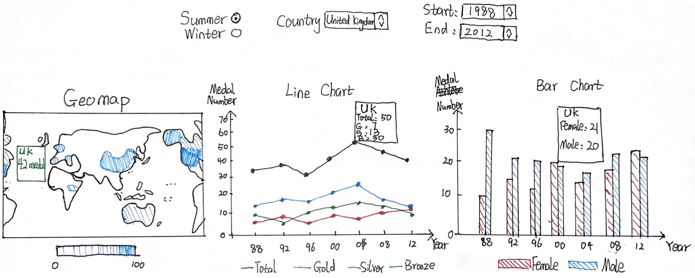

# Proposal for Visualization of Olympic Performances

## Overview
The Olympics have long been known as the symbol of competitive athletic spirit, while they have also witnessed historical events and changes. In the first Olympic female athletes were not even allowed to compete, but now more and more female athletes are competing for themselves, for their nation and for their people. From WWII to the modern day COVID pandemic, people continue to show their resilience and perseverance with participation in the Olympics. How did my nation perform in the Olympics? That might be a question that comes naturally when you’re watching them. For our project, we intend to propose a visualization system that helps the general audience to find out how each nation performs in the Olympics on a time scale.

## Description of Dataset and Processing
We found and will visualize a dataset named [Olympic Sports and Medals, 1896-2014](https://www.kaggle.com/datasets/the-guardian/olympic-games), which contains about 37,000 records of every Olympic athlete that has won a medal from the first Olympics Athens 1896 to the XXII Olympic Winter Games Sochi 2014. Each record consists of 9 attributes that describe the information of an awarded athlete: game year, host city, athlete name, athlete country code, athlete gender, sport, discipline, event and the type of medal awarded.
The data was provided by the IOC Research and Reference Service and published by the Guardian's Datablog, so it is highly reliable. Although a few records are missing information, we have filled them using data from the International Olympic Committee’s website. In order to improve user experience in the visualization, we aggregate statistics from the original dataset and export a much smaller dataset in size, which enables better processing/loading speed and thus better user experience.
Not all attributes provided by the original dataset will be used in this project. Only a few of them are aggregated into a processed dataset and will be visualized:

- Olympic Game Year
- Summer/Winter Olympic Game
- Number of total/gold/silver/bronze medal a country won in an Olympic game
- Number of medal a country won by male/female in an Olympic game

## Usage Scenarios & Tasks
After watching the 2020 Tokyo Olympics, Lily is so intrigued that she would like to know more about how each nation is performing in the Olympics. She wants to know how many medals her nation has won in previous games and its historic changes. She also wants to see how female athletes are doing in the games. So she logs on to the visualization system, and sees a geographical map of the world. Each country is colored with a different gradient by the number of medals they historically won. She gets the sense that her nation ranks pretty high for the numbers and immediately hovers over it. The following line and bar chart change accordingly. The line chart shows the number of gold, silver, and bronze medals achieved by her nation from 1896 to 2014. The bar chart shows the number of athletes participating in the olympics. She notices that more and more athletes are competing in the games, and it’s becoming more gender balanced. Besides the chart, there’s a drop-down list for her to select a specific country. She selects the country her friend comes from, and all  three charts change to the data about that country. She is now able to compare between different countries and she sees that the gender distribution of the athletes is pretty skewed. These all help her to see how each nation is performing in the Olympic games throughout time and to compare them.

## Description of Visualization & Sketch
Three views will be presented in this project: geo-map, line chart, and bar chart respectively.

The first view (geo-map) visualizes a country’s performance in the Olympics determined by the total number of medals won and using color legend. When hovering over a country, a tooltip pops up showing the name of the country as well as how many medals the country won. 

The second view (line chart) visualizes the trend of total/gold/silver/bronze medals won by a country in a period of time. When hovering over a point, a tooltip shows up showing the country’s name as well as a detailed breakdown of how many medals the country won. 

The third view (grouped bar chart) visualizes the comparison of the number of medals a country won by female and male athlete in a period of time. When hovering over a grouped bar, a tooltip shows the country's name with how many medals females and males won respectively. 

There are 5 UI widgets designed for these views: one radio button for users to choose to display summer or winter Olympic data; one drop-down for users to select the country of interest; two  drop-downs for users to choose the start and end years of their time period. All three views are linked together. When users modify filters in UI widgets, all three views will be updated. The line chart and the grouped bar chart are linked bidirectionally. When hovering over a point or a grouped bar, the corresponding grouped bar and points will be highlighted immediately, and the geomap data updates as well.

The must-have features for this project is the interactions/links among the three views, without which the project would not be as interesting. The three views linked together give users multidimensional information about how a country performed in the past games. From horizontal comparison (number of medals a country won) to vertical comparison (number and type of medals a country won) to gender comparison (number of medals a country’s male and female athletes won), users are able to receive key information necessary to easily gauge how well a country has performed in the Olympics.

## Work Breakdown and Schedule

| Task  |Estimated Time |Target Date|Notes|
| ------------- | ------------- | ------------- | ------------- |
| Geo-map (static view) - Calvin|2 hrs|4/25/22|- Draw projection of world borders using D3. - Define colormap encoded by medal count.|
|Line Chart (static view) - Anran|2 hrs|4/27/22|Define axes and scales using medal data.Plot points for bronze, silver, gold, and total medal count.Draw respective lines.|
|Bar Chart (static view) Haoxuan|2 hrs|4/29/22|Define axes and scales using medal data. Draw bars for male, female, and total medal count.|
|Geo-map (interactive view) Calvin|2 hrs|5/1/22|Implement highlighting of regions on mouse event. Create tooltip displaying selected country’s performance.|
|Line Chart (interactive view) Anran|2 hrs|5/3/22|Implement highlighting of points on mouse event. Create tooltip displaying year and medal count.|
|Bar Chart (interactive view) Haoxuan|2 hrs|5/5/22|Implement highlighting of bars on mouse event. Create tooltip displaying year and medal count.|
|Linking the views Calvin Anran Haoxuan|2 hrs|5/7/22|Add drop-down selectors for choosing time period, event, and country. Link drop-down selector to filter the data visualized in the views. Link geo-map mouse event to the country selection of the line chart and bar chart.|
|Optional features Calvin Anran Haoxuan|Remaining time|5/9/22|TBD|

